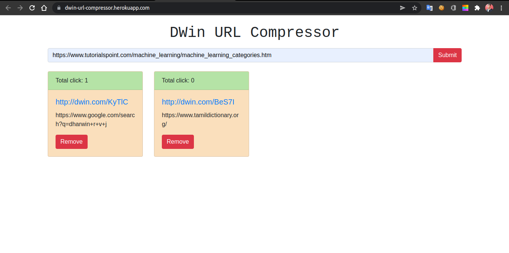
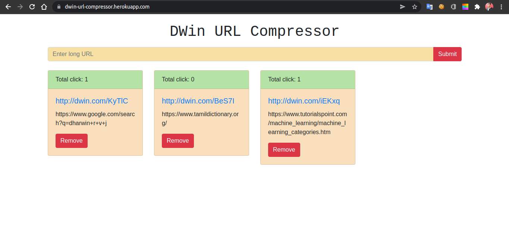

# dwin-url-compressor
## URL Compressor to compress long URL using NodeJS and MongoDB
## Live Demo: https://dwin-url-compressor.herokuapp.com

## [MongoDB(Installation and Configuration)](https://docs.mongodb.com/v5.0/tutorial/install-mongodb-on-ubuntu/)
